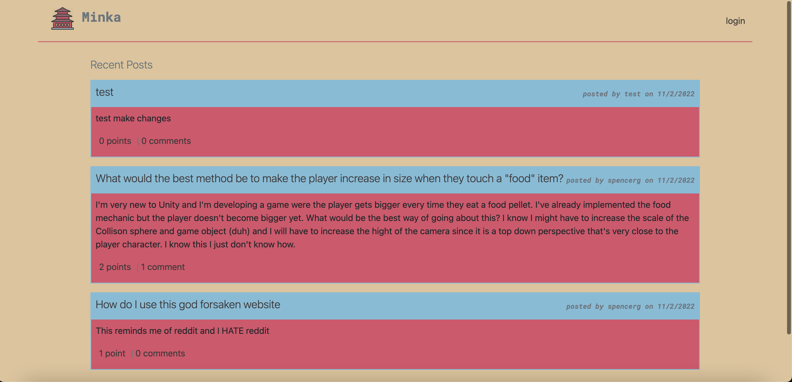

# Minka - Developers Notes and Questions Forum  

  

## 🚀 About Minka  
Minka is a **tech forum** designed **by developers, for developers** to ask programming-related questions, share insights, upvote posts, and engage in discussions with the community.  

### 🔗 Live Demo  
[Check out Minka in action!](#) *(Add link here when deployed)*  

---

## 📌 Table of Contents  
- [Features](#features)  
- [Installation](#installation)  
- [Usage](#usage)  
- [Technologies Used](#technologies-used)  
- [Contributing](#contributing)  
- [Tests](#tests)  
- [Questions](#questions)  
- [Credits](#credits)  

---

## ✨ Features  
✅ **Post Questions** - Ask and answer programming-related questions.  
✅ **Upvote & Downvote** - Give visibility to the best answers.  
✅ **Comment System** - Engage in discussions under posts.  
✅ **User Authentication** - Secure login system.  
✅ **Mobile Responsive UI** - Optimized for **desktop & mobile**.  

---

## ⚙️ Installation  
To set up the project locally:  
```bash
git clone https://github.com/kevinuriarte/Minka.git  
cd Minka  
npm install